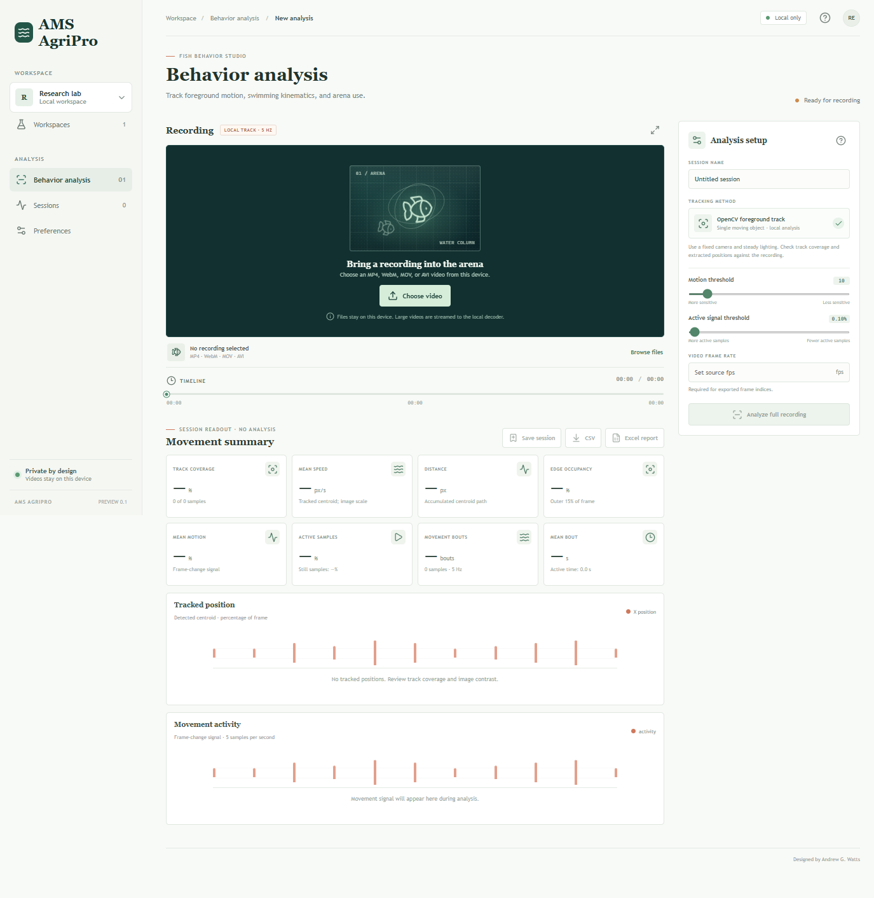

# AMS AgriPro Fish Analysis

A local-first fish behavior analysis app. Recordings are analyzed on the same computer and are never sent to a remote service.

## App preview



## Run locally

```sh
npm install
python -m venv .venv
.venv/Scripts/python -m pip install -r requirements.txt
npm run dev
```

`npm run dev` starts both the React UI (`http://127.0.0.1:5173`) and the loopback-only Python API (`127.0.0.1:8000`). Open that address in a current Chrome, Edge, Firefox, or Safari browser on the same computer as the API. File selection, uploads, storage and downloads use standard browser APIs. The API deliberately stays on loopback, so other computers and phones cannot connect. On macOS/Linux, install with `.venv/bin/python -m pip install -r requirements.txt` instead.

Production build: `npm run build`. Lint: `npm run lint`.

## Analysis scope

Select an AVI, MP4, MOV, MKV, WebM, MPEG, or MPG video, adjust the foreground pixel threshold and activity cutoff, then analyze the full recording. Every format is streamed to the loopback-only OpenCV service and sampled at up to 5 Hz. The tracker reports one moving foreground component's normalized centroid, contour area, image-plane orientation, pixel speed, turning rate, center/edge occupancy, track coverage, global pixel-change signal, active share, and activity bouts. The recording preview is a representative extracted frame, not synchronized video playback.

This is classical foreground segmentation and centroid association, not a deep-learning fish detector or validated pose-estimation model. It follows one moving component and can track reflections, debris, bubbles, or shadows instead of the animal. Speed and distance are in pixels unless the image is spatially calibrated; the contour orientation is an image-plane principal axis and is ambiguous by 180 degrees. Tail-beat frequency, body-midline curvature, multi-fish identity, and species recognition are not measured. Track coverage is provided to make misses visible. Validate settings and compare against manually annotated footage for each camera, species, and protocol before scientific use.

There is no application-imposed upload-size limit. Videos are streamed to temporary disk in bounded chunks, decoded sequentially, and the temporary source is removed after processing. Ensure the temporary-disk drive has enough free space. Frames are reduced to at most 480 pixels on the longest edge; sampled metrics are retained, not full-resolution frames. OpenCV codec support depends on the local installation.

## Data handling

Video files are written to a temporary file, deleted after analysis, and accepted only on the loopback-only API. Sessions and preferences are stored in local browser storage; session records include sampled results and file metadata but not the video. Export CSV for raw samples or Excel for a movement summary plus all track samples. The API binds to `127.0.0.1`; do not change it to a public network interface.

## GitHub

The `.venv`, `node_modules`, Python bytecode, and build output are excluded by `.gitignore`. Commit `package-lock.json` and `requirements.txt` so dependencies can be restored. Do not commit videos, private study data, or `.env` files.
